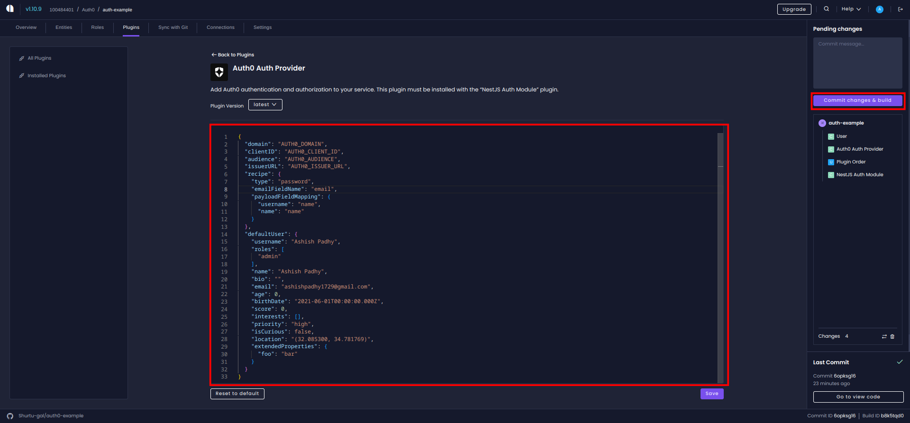
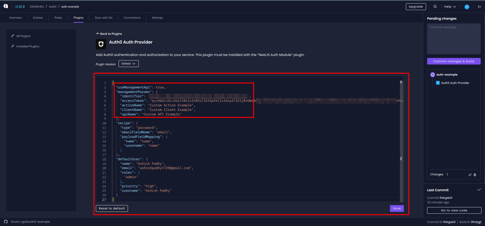
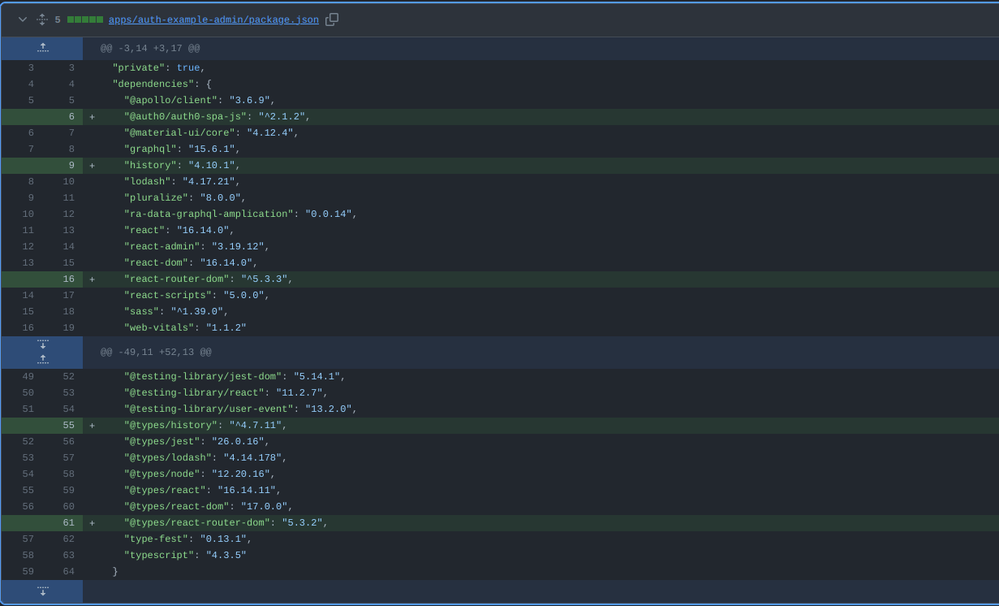
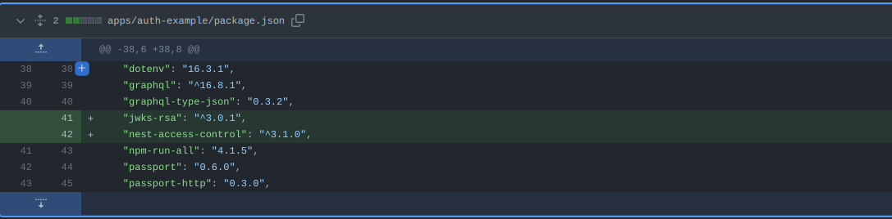
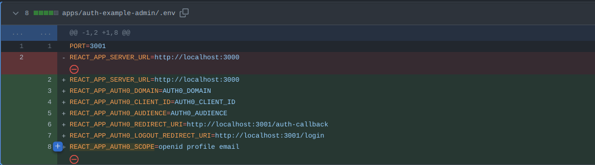
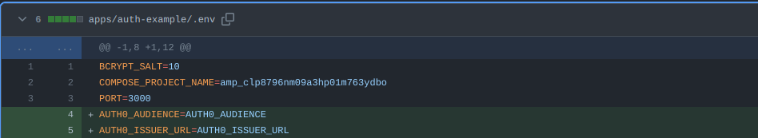
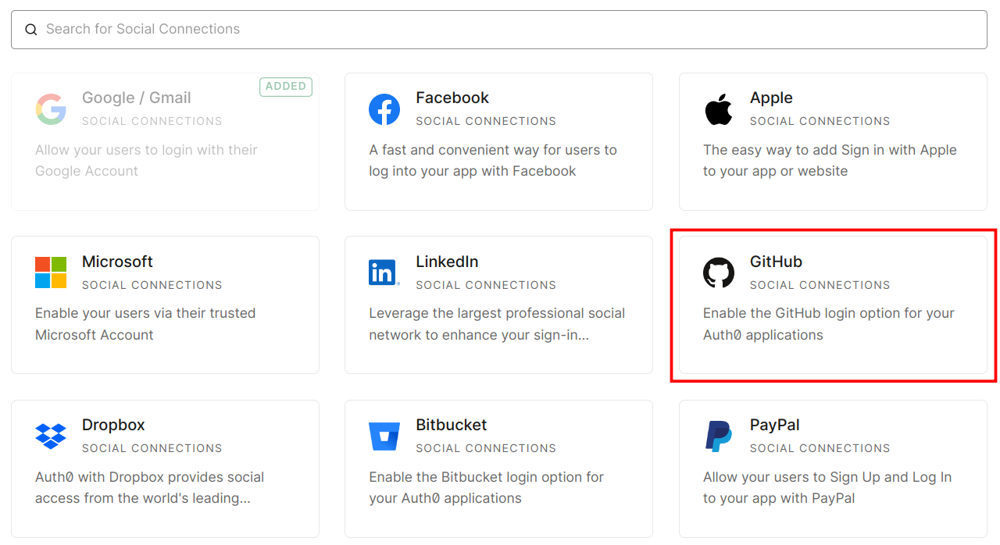
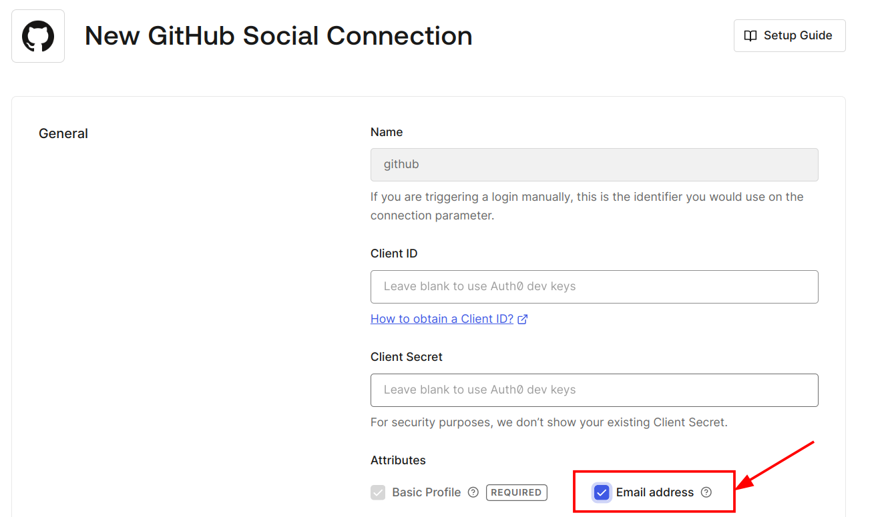
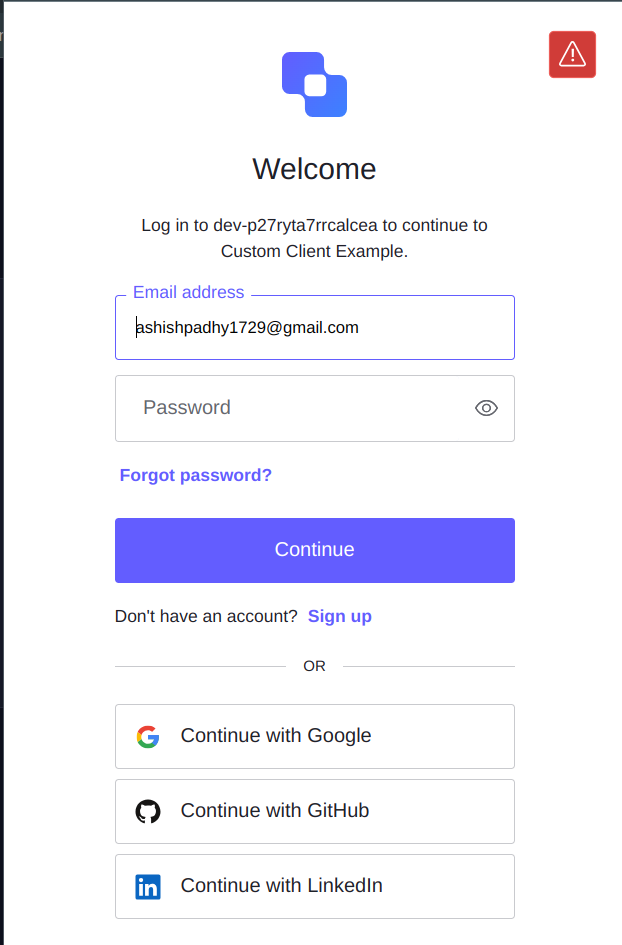

## Introduction

[Auth0](https://auth0.com) is a cloud service that provides a turn-key solution for authentication, authorization and user management. It is a feature-rich service that is highly customizable and can be used in a variety of ways. Auth0 is a great choice for a wide range of applications, from simple web apps to enterprise applications. It provides a great way to add authentication and authorization to your application without having to build it yourself, and has various integrations with services such as Google, Facebook, Twitter, and more. This along with its passwordless authentication and multi-factor authentication makes it a great choice for a wide range of applications.

## How to use Auth0 authentication in your Amplication application

Setting up Auth0 authentication in your [Amplication](https://amplication.com/) application is easy. You can use the [Auth0 plugin](https://github.com/amplication/plugins/tree/master/plugins/auth-auth0) to add the required dependencies and configuration files to your application. The steps are as follows:

### Create a service in amplication

Start by creating a service within the Amplication platform. Once your service is set up, click on the `Commit changes & build` button to initiate the build process. Merge the generated Pull Request to move ahead.

### Add the NestJS Auth Module

Next, add the NestJS Auth Module to your service. You can do this by navigating to the **Plugins** section within your service topbar menu. 

> Also create and set an authentication entity if you have not done so yet. For more information on how to do this, see the [**Authentication** section of the Amplication documentation](https://docs.amplication.com/how-to/add-delete-user-entity/).

### Add the Auth0 plugin

Next, add the Auth0 plugin to your service. You can do this by navigating to the 'Plugins' section within your service sidebar menu, where you'll see a list of available plugins and installed plugins(see screenshot below for reference).

<div>

</div>
<br />

After installing the plugin you have to provide settings for the plugin. You can do this by clicking the `settings` button next to the plugin name. 
After this you can follow the instructions in the [**Plugin** to configure your Auth0 account](https://github.com/amplication/plugins/blob/master/plugins/auth-auth0/README.md)

To provide a summary of the steps:

1. Create an Auth0 account
2. Create an Auth0 application and API
3. Configure the Auth0 application
4. Configure the Auth0 plugin

The settings will look something like the following picture:
<div>

</div>
<br />

Then click the `Save` button to save the settings and commit the changes.

> Some things to note:
> - The `domain`, `clientId`, `issuerURL`, and `audience` are required fields. These are the values you get from your Auth0 account.
> - The `emailFieldName` provided must be present in the authentication entity.
> - `defaultUser` will be used to create a default and new users.

### Alternative: Automate setup of Auth0 account

If you hate having to setup everything manually, or just don't have access to the auth0 account, then you don't have to worry as I have go you covered. Introducing [Auth0 Management API](https://auth0.com/docs/api/management/v2). Using this all the nifty work will be done for you. All you have to do is provide is a access token with necessary permisssions. You can also customise the names 🤖🚀.

For how to get the access token and the permissions required, see the [**Plugin Docs**](https://github.com/amplication/plugins/blob/master/plugins/auth-auth0/README.md#using-management-api)

After getting these you can add them to the plugin settings as shown below:
<div>

</div>
<br />

Then click the `Save` button to save the settings and commit the changes. This will trigger a build and the plugin will do the rest for you.

> Some things to note:
> - If there are already actions and api with that name, the plugin will not create them again.

As you can see on [this PR](https://github.com/Shurtu-gal/auth0-example/pull/3) from our example repo, the plugin has created the actions and api for us. 🎉🎉🎉

## How things work

### Manual method :- 

The plugin will create the following files for you as seen in this [**PR**](https://github.com/Shurtu-gal/auth0-example/pull/3/files).

- Adds the required dependencies to the `package.json` file.

<div>

</div>
<br />

<div>

</div>
<br />

The `@auth0/auth0-spa-js` and `jwks-rsa` help in adding the authentication and authorization to the frontend and backend respectively. While `react-router-dom` is used to add the routes to the frontend.

<hr />

- Adds the required .env variables to the `.env` file used in the frontend and backend.

<div>

</div>
<br />

<div>

</div>
<br />
<hr/>

- Adds `ra-auth0-provider` to the `Admin`. This is used to setup Auth0 in the frontend. It provides the `authProvider` prop to the `Admin` component, and has requisite `login`, `logout` functions.

```ts
import { Auth0Client } from "@auth0/auth0-spa-js";
import { AuthProvider, UserIdentity } from "react-admin";

export const PreviousLocationStorageKey = "@react-admin/nextPathname";

export const client = new Auth0Client({
  domain: process.env.REACT_APP_AUTH0_DOMAIN || "",
  clientId: process.env.REACT_APP_AUTH0_CLIENT_ID || "",
  cacheLocation: "localstorage",
  authorizationParams: {
    audience: process.env.REACT_APP_AUTH0_AUDIENCE,
    scope: "openid profile email",
  },
  useRefreshTokens: true,
});

export const auth0AuthProvider: AuthProvider = {
  login: async () => {
    await client.loginWithPopup({
      authorizationParams: {
        redirect_uri: process.env.REACT_APP_AUTH0_REDIRECT_URI,
      },
    });

    return Promise.resolve();
  },

  logout: async () => {
    await client.logout({
      logoutParams: {
        returnTo: process.env.REACT_APP_AUTH0_LOGOUT_REDIRECT_URI,
      },
    });

    return Promise.resolve();
  },

  async checkAuth() {
    const isAuthenticated = await client.isAuthenticated();
    if (isAuthenticated) {
      return Promise.resolve();
    }

    localStorage.setItem(PreviousLocationStorageKey, window.location.href);

    return Promise.reject();
  },

  checkError: async ({ status }) => {
    if (status === 401 || status === 403) {
      throw new Error("Unauthorized");
    }
  },

  getPermissions: async () => {
    if (!(await client.isAuthenticated())) {
      return;
    }

    await client.getIdTokenClaims();
    Promise.resolve();
  },

  getIdentity: async () => {
    if (!(await client.isAuthenticated())) {
      throw new Error("User not authenticated");
    }

    const user = await client.getUser();

    if (!user) {
      throw new Error("User not found");
    }

    return {
      id: user.sub,
      fullName: user.name,
      avatar: user.picture,
      email: user.email,
    } as UserIdentity;
  },

  handleCallback: async () => {
    const query = window.location.search;
    if (query.includes("code=") && query.includes("state=")) {
      try {
        await client.handleRedirectCallback();
        return;
      } catch (error) {
        throw new Error("Failed to handle login callback: " + error);
      }
    }
    throw new Error("Failed to handle login callback.");
  },
};
```
<hr/>

- Adds the logic to get access token in graphql provider as seen in these [**lines**](https://github.com/Shurtu-gal/auth0-example/blob/2f4b7f69056ffbd8bc89871bb315babb7805cd9e/apps/auth-example-admin/src/data-provider/graphqlDataProvider.ts#L11-#L17)

- Adds custom login page to the admin app. This is done by changing the default [Login.tsx](https://github.com/Shurtu-gal/auth0-example/pull/3/files#diff-ce95c848675c3daf98191c954e40b94a18522c0b56ffb2f980d15179ac45c098) file.

- Adds the `JWT Base Strategy` to the backend. This checks the **JWT** token sent in the request header and verifies it using the **JWKS** key provided by Auth0. This is done by adding the following code to the `src/auth/jwt/base/jwt.strategy.base.ts` file. And then validating it in the database using `validateBase` function.

```ts
import { ConfigService } from "@nestjs/config";
import { PassportStrategy } from "@nestjs/passport";
import { passportJwtSecret } from "jwks-rsa";
import { ExtractJwt, Strategy } from "passport-jwt";
import { Auth0User } from "./User";
import { UserInfo } from "../../UserInfo";
import { UserService } from "src/user/user.service";

export class JwtStrategyBase extends PassportStrategy(Strategy) {
  constructor(
    protected readonly configService: ConfigService,
    protected readonly userService: UserService
  ) {
    super({
      jwtFromRequest: ExtractJwt.fromAuthHeaderAsBearerToken(), // Extract JWT from the Authorization header
      audience: configService.get("AUTH0_AUDIENCE"), // The resource server where the JWT is processed
      issuer: `${configService.get("AUTH0_ISSUER_URL")}`, // The issuing Auth0 server
      algorithms: ["RS256"], // Asymmetric signing algorithm

      secretOrKeyProvider: passportJwtSecret({
        cache: true,
        rateLimit: true,
        jwksRequestsPerMinute: 5,
        jwksUri: `${configService.get(
          "AUTH0_ISSUER_URL"
        )}.well-known/jwks.json`,
      }),
    });
  }

  // Validate the received JWT and construct the user object out of the decoded token.
  async validateBase(payload: { user: Auth0User }): Promise<UserInfo | null> {
    const user = await this.userService.findOne({
      where: {
        email: payload.user.email,
      },
    });

    return user ? { ...user, roles: user?.roles as string[] } : null;
  }
}
```
<hr/>

- Adds the `JWT stratgey` code which is editable by users to the backend. This is done by adding the following code to the `src/auth/jwt/jwt.strategy.ts` file. And then validating it in the database using `validate` function.

```ts
import { Injectable } from "@nestjs/common";
import { JwtStrategyBase } from "./base/jwt.strategy.base";
import { ConfigService } from "@nestjs/config";
import { Auth0User } from "./base/User";
import { IAuthStrategy } from "../IAuthStrategy";
import { UserInfo } from "../UserInfo";
import { UserService } from "src/user/user.service";

@Injectable()
export class JwtStrategy extends JwtStrategyBase implements IAuthStrategy {
  constructor(
    protected readonly configService: ConfigService,
    protected readonly userService: UserService
  ) {
    super(configService, userService);
  }

  async validate(payload: { user: Auth0User }): Promise<UserInfo> {
    const validatedUser = await this.validateBase(payload);
    // If the entity is valid, return it
    if (validatedUser) {
      return validatedUser;
    }

    // Otherwise, make a new entity and return it
    const userFields = payload.user;
    const defaultData = {
      email: userFields.email,
      name: userFields.name,
      username: userFields.name,
      roles: ["admin"],
    };

    const newUser = await this.userService.create({
      data: defaultData,
    });

    return { ...newUser, roles: newUser?.roles as string[] };
  }
}
```

In this code, if a user is not found in the database then a new user is created with the default roles as `admin`. This can be changed by the user as per their requirements and needs. 

> **Note** :- Please make sure that the field names in the `defaultData` object are present in the authentication entity.
> Also make sure of the role you wish to assign to the user. In this case it is `admin`.

- Adds the `User` type to the `src/auth/jwt/base/User.ts` file. This is used to get the user data from the JWT token.

```ts
export interface Auth0User {
  nickname: string;
  username: string;
  name: string;
  email: string;
  email_verified: boolean;
  picture: string;
}
```

The types of the fields in this interface can be changed as per the requirements of the user and generally varies from application to application. You can find more information about the fields [here](https://auth0.com/docs/secure/tokens/json-web-tokens/create-custom-claims). However, the `email` field is required as it is used to identify the user. Also, if you want some fields you may have to change the **scope** in the `src/auth-provider/ra-auth-auth0.ts` in the frontend.

## Customization - Add social connections

With [Auth0](https://auth0.com/) you can add social connections to your application. This allows users to login to your application using their social media accounts. This allows you to provide a more personalized, secure and passwordless experience for your users. You can add social connections to your application by following the steps below:

1. Go to the [**Auth0 Social Connections**](https://manage.auth0.com/#/connections/social/create) page. You will see various options out there as can be seen below.

  <div>
    
  </div>
  <br />
  <hr/>

2. Here I am choosing GitHub however, you can choose any of the options available. The steps are nearly similar to each other.
3. After choosing the option, you will be redirected to the configuration page for that option. Here you can configure the connection as per your requirements. You can also add custom scopes to the connection. For more information on how to do this, see the [**Marketplace documentation**](https://marketplace.auth0.com/integrations/github-social-connection). 

> **Note** :- Make sure to add the `email` scope to the connection as shown in the image. This is required to get the email of the user.

  <div>
    
  </div>
  <br />
  <hr/>

4. Click the `Create` button to create the connection. This will redirect you to the **Connection setup** page where you can configure on which apps you should add this. 

5. Now, the connections should be visible in the login page of your application. You can see the login page of the example application below.

  <div style="display: flex; flex-direction: row; justify-content: center;">
    
  </div>
  <br />
  <hr/>

## Future Work

Make the plugin more customizable by adding more options to the plugin settings. This will allow the user to customize the plugin as per their requirements. Some of the options that can be added are:

- Authentication using phone number
- Passwordless authentication
- Two factor authentication
- Adding custom roles

If you have any other suggestions, please feel free create an issue at the [**Auth0 plugin repo**](https://github.com/amplication/plugins/issues/new)

## Outro

[Amplication's Auth0 Plugin](https://github.com/amplication/plugins/blob/master/plugins/auth-auth0) provides a powerful but effortless way to add authentication to your application. It is easy to use and can be configured in a few minutes thus reducing complexity overhead.

**I hope this blog post was helpful to you. If you have any questions or suggestions, please feel free to reach out to me on [Twitter](https://twitter.com/Shurtu_Gal), [GitHub](https://github.com/Shurtu-gal/) or [LinkedIn](https://www.linkedin.com/in/ashish-padhy3023/). I would love to hear from you.**
